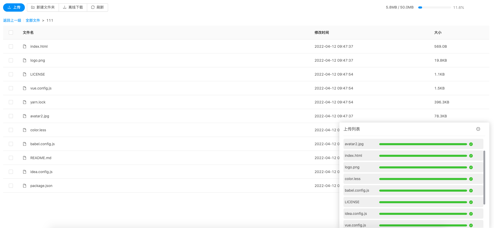

# fileCloud

仿百度网盘，实现个人文件存储云盘。

## 功能支持

- 文件上传。 支持单文件、多文件、文件夹上传
- 文件、文件夹拷贝、移动
- 文件下载
- 在线预览 todo
- 分享链接 todo


## 页面展示




## 分片上传、断点续传

文件过大时，上传文件需要很长时间，且中途退出将导致文件重传。

分片上传: 上传文件时，在本地将文件按照 4M 的大小将文件进行分片。在服务器端将文件组合。

断点续传: 如果文件没有上传完，关闭客户端。再一次上传文件时，对比服务器已经上传的分片，只需要上传没有的分片。

程序重启时，由于不保存目录结构和上传进度。会删除已经上传的文件分片，再次上传从头开始。

## 秒传

每一个文件都有对应的md5码。当检测上传文件时，如果本地已经存在相同md5的文件，则不需要用户上传。

## 文件保存方案

SaveFileMultiple 文件是否保存为多份。

已经存在md5文件时
- 当 SaveFileMultiple=false，仅添加文件指向，当前文件夹下不存在该文件，即整个云盘只存在一份源文件。
删除时，判读文件引用，当引用为0时执行文件的删除;若删除源文件且还有文件引用，将文件移动到引用处。
- 当 SaveFileMultiple=true，会将源文件拷贝一份到当前目录。整个云盘存在多份文件，磁盘占用为N倍。删除时，直接删除当前文件。

由于不设计目录结构的保存，故 SaveFileMultiple=false时，程序重启会恢复到真实目录文件结构。

## 不做目录结构和文件上传分片保存说明

目录结构，文件上传分片保存在内存中。程序重启后会丢失信息。

若目录文件存在手动修改，保存信息后重启将导致文件数据不匹配，保不保存意义不大。

若目录文件不存在手动修改，仅有 SaveFileMultiple=false 时,重启时需要还原到停机状态才需要保存信息。
而 SaveFileMultiple=true，重启加载目录与停机时一致，不需要保存信息。

故重启目录结构显示是真实的目录结构。上传的文件分片会在重启加载时删除。


## 启动

前端： vue4.5.15 + antd1.7.8

后端： go1.17.7 + gin 

### 前端项目

切换到 `front-vue` 目录

安装依赖 `yarn install `

更改 `src/config/config.js` 第1行 `const target = 'http://127.0.0.1:9987'` 地址

运行 `yarn run serve `

打包 `yarn build` , 运行后会在`front-vue`目录生成 `dist` 文件夹，里面就是构建打包好的文件

### 后端项目

切换到 `back-go/cmd` 目录

配置 `config.toml`
```
  WebAddr   = "127.0.0.1:9987"            # web 地址
  WebIndex  = "../../front-vue/dist"      # web html目录
  FilePath  = "cloud"                     # 文件存放目录
  SaveFileMultiple = true                 # 文件是否保存为多份
  FileDiskTotal    = 50                   # 配置的网盘容量，单位 M
```

启动 `go run filecloud.go` 或者 `go build filecloud.go`+`./filecloud`


3. 浏览器访问 `127.0.0.1:9987` 。用 `http` 方式访问。


